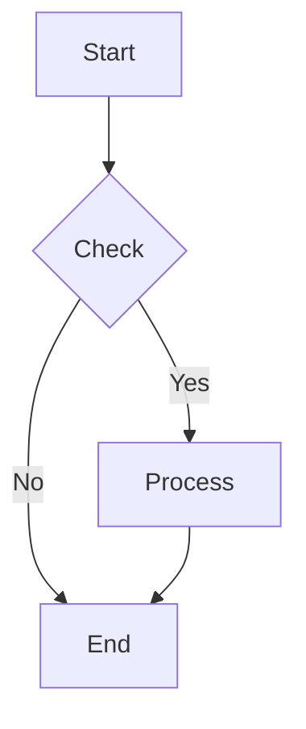
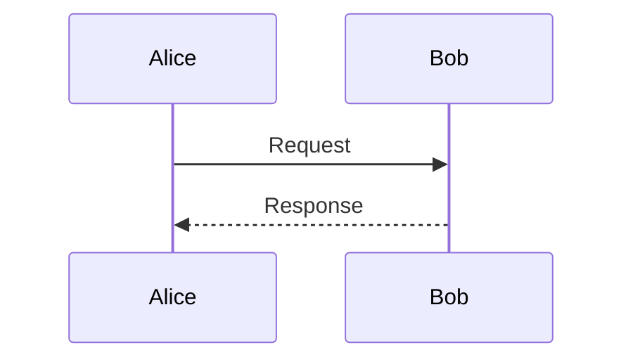
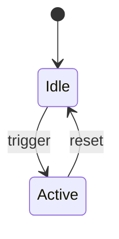

# Beautiful Mermaid

Render Mermaid text diagrams to ASCII/Unicode or SVG.

## Quick Start

```bash
# ASCII output (chat-friendly)
node scripts/mermaid-render.mjs ascii "graph LR
A --> B --> C"

# SVG output
node scripts/mermaid-render.mjs svg "graph TD
A --> B" -o diagram.svg
```

## Supported Diagram Types

| Type | Header |
|------|--------|
| Flowchart | `graph TD`, `graph LR`, `flowchart TD` |
| State | `stateDiagram-v2` |
| Sequence | `sequenceDiagram` |
| Class | `classDiagram` |
| ER | `erDiagram` |

## ASCII Mode

```bash
node scripts/mermaid-render.mjs ascii "graph LR
A[Start] --> B{Decision}
B -->|Yes| C[Action]
B -->|No| D[End]"
```

Output:
```
┌───────┐     ┌──────────┐     ┌────────┐
│       │     │          │     │        │
│ Start ├────►│ Decision ├────►│ Action │
│       │     │          │     │        │
└───────┘     └────┬─────┘     └────────┘
                   │
                   ▼
              ┌────────┐
              │  End   │
              └────────┘
```

Options:
- `--ascii` — Use pure ASCII (no Unicode box-drawing)

## SVG Mode

```bash
node scripts/mermaid-render.mjs svg "graph TD
A --> B" -o output.svg -t tokyo-night
```

Options:
- `-o, --output <path>` — Write to file
- `-t, --theme <name>` — Apply theme
- `--list-themes` — Show available themes

## Input Methods

```bash
# Inline
node scripts/mermaid-render.mjs ascii "graph LR
A --> B"

# From file
node scripts/mermaid-render.mjs ascii -f diagram.mmd

# From stdin
echo "graph LR
A --> B" | node scripts/mermaid-render.mjs ascii
```

## Common Patterns

### Flowchart


### Sequence


### State


## Notes

- Mermaid syntax requires newlines between nodes (`;` alone won't work for ASCII)
- ASCII output works great in code blocks on messaging platforms
- For complex diagrams, save SVG and share as image
